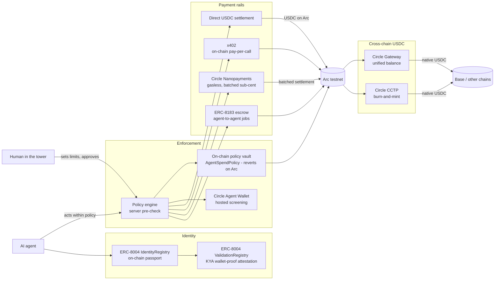

# A-Identity - Architecture (for reviewers)

**A passport (on-chain identity) + wallet (USDC payments) for AI agents.**
An agent gets a verifiable identity, proves it controls its wallet, is given spend limits a
human sets, and can then pay other agents.

Live: **https://a-identity.xyz** · backend **https://a-identity-backend.onrender.com**.
Circle Arc (5042002) is the phase-1 network and is testnet, so value moving there is test
value. It is not the only network: four mainnets carry our own traffic and real money -
**OKX X Layer**, **Celo**, **Robinhood Chain** and **Arbitrum One** - and a fifth,
**Stellar pubnet**, holds a deployed spend vault that a real USDC budget has been spent
through, across eleven registry entries in total. The header used to name Arc alone while the sections below already
described the rest, which is how a reader ended up with the wrong idea of the blast radius.
[`mcp/src/chains/registry.ts`](mcp/src/chains/registry.ts) is the source of truth for which
chain is which, and [SECURITY.md](SECURITY.md) lists every signer and what it can spend.

Everything below is real code broadcasting real transactions - no mocks in the core flow.

---

## The flow

*Live PNG: [a-identity.xyz/architecture.png](https://a-identity.xyz/architecture.png). Source (rendered by GitHub) below.*

## Three independent enforcement layers

A payment is checked in depth - a limit you set is enforced in **three** ways:

1. **Server policy engine** (`mcp/src/platform.ts`) - the pre-check: daily cap, auto-approve
   ceiling, payee allowlist, freeze, human-approval gate (00:00 UTC reset).
2. **On-chain policy vault** (`mcp/contracts/AgentSpendPolicy.sol`) - a per-agent USDC contract
   that enforces the same policy **on Arc**: an over-limit `pay()` *reverts on-chain*. This is the
   trustless source of truth; the server is only the pre-check + fallback. The vault is deployed
   with the human's real wallet as **`owner`** (freeze / override / withdraw) and, in this build,
   the **server signer as the delegated `operator`** that calls `pay()` on the agent's behalf -
   so the *limit* is trustless (the contract reverts regardless of who signs), while *initiating*
   the payment is a delegated action. Roadmap: hand the `operator` role to an agent-held key /
   Circle programmable wallet so the agent signs its own payments end-to-end.
3. **Circle Agent Wallet** (`mcp/src/circle-agent.ts`) - a hosted, Developer-Controlled wallet
   whose policy engine screens each transfer at the wallet layer (sanctions / allow-block / freeze).

`executeInstruction` routes a payment **vault → Circle → direct settlement**, each additive with a
fallback, so one layer failing never fabricates a success.

## Standards

| Standard | Where | What it does |
|---|---|---|
| **ERC-8004** Identity | `0x8004A818…BD9e` | On-chain agent passport (ERC-724). Real `register` tx per agent. |
| **ERC-8004** Validation | `0x8004Cb1B…4272` | **KYA**: the agent signs a challenge (viem `verifyMessage`); the result is attested on the ValidationRegistry (`validationRequest` + `validationResponse=100`, tag `"kya"`). |
| **ERC-8183** Commerce | `0x0747EEf0…4583` | Agent-to-agent job escrow: create → setBudget → approve → fund → submit → complete; USDC held in escrow, released on delivery. |
| **x402** | `mcp/src/x402.ts` | HTTP-402 pay-per-call: server returns 402 + requirements, client pays USDC on Arc, server verifies on-chain (with replay protection) and serves the resource. |
| **Circle Gateway** | `mcp/src/gateway.ts` | Chain-abstracted USDC: deposit on Arc → a unified balance, then move it to Base Sepolia via the Forwarding Service (signed EIP-712 burn intent). Minted on Base in <500 ms, gaslessly. Permissionless - no Circle API key. |
| **Circle Nanopayments** | `mcp/src/nanopay.ts` | The second x402 rail: the `exact`/`GatewayWalletBatched` scheme. Buyer signs an **EIP-3009 authorization off-chain (0 gas)**; Circle Gateway verifies + credits instantly and **batches** the on-chain settlement - sub-cent USDC becomes economical. Permissionless on Arc testnet (`@circle-fin/x402-batching`); buyer balance = the same Gateway Wallet deposit (`0x0077…19b9`). |
| **Circle CCTP** | `mcp/src/cctp.ts` | Native USDC cross-chain by **burn-and-mint** (CCTPv2 via `@circle-fin/bridge-kit`): burn on Arc → attest → mint natively on Base Sepolia (never wrapped). Canonical bridge, distinct from Gateway's unified-balance forwarding. |

> Circle products used: **USDC, Wallets, Gateway, Nanopayments, CCTP** - all live on Arc testnet.

### Gated products - architecture-level (USYC, StableFX)

USYC and StableFX are enterprise-gated (access by request). Per the hackathon rules,
conceptual/architecture-level integration is accepted with no penalty. Where they fit:

- **USYC - idle-treasury yield.** An agent treasury spends in bursts; between bursts USDC
  sits idle. The policy layer parks the surplus above a liquidity floor in **USYC** (Circle's
  tokenized money-market fund) and pulls it back when spending picks up - yield without losing
  the ability to pay. Surfaced today in the *"idle USDC parks itself in USYC"* use case; the
  `AgentSpendPolicy` vault is the natural on-chain home for the park/unpark rule once access is granted.
- **StableFX - cross-currency settlement.** An agent paid in USDC that must settle a EURC
  invoice (or vice-versa) uses **StableFX** to convert at settlement time, so the bounded-authority
  policy and reputation travel across currencies for cross-border agent-to-agent commerce.

### Autonomy - the agent runs itself, bounded

`mcp/src/autopilot.ts` (`POST /api/arc/agent-run`) is the autonomous economic experience: a
human sets a budget once, then the agent makes a **burst of real gasless nanopayments** to a
service (pay-per-inference / streaming) on its own and **stops itself** the moment the next
payment would breach the budget - bounded authority, demonstrated live, no human per payment.
Each run routes a **protocol fee** (basis points of volume) to an A-Identity treasury as one
real settlement - the on-chain proof of the "fee per settlement" model.

## Verifiable on-chain proof

### Arc testnet

- **Showcase agent "Meridian"** - ERC-8004 id **#849980**, KYA attested on-chain, policy vault,
  reputation **539** from 3 real settlements. Anchor tx:
  [`0x506b125f…`](https://testnet.arcscan.app/tx/0x506b125f3a0481667e3a00dcb86f48cbcaa35c643af963365e9389b06a8f8e54) ·
  KYA attestation: [`0x758ddbfa…`](https://testnet.arcscan.app/tx/0x758ddbfad38daeb772a37deb07e65339f13aeb393899fc7e1d2689c95adf0dad)
- **Completed ERC-8183 escrow job #155504** - full lifecycle settled on Arc.
  createJob [`0xcce5a56c…`](https://testnet.arcscan.app/tx/0xcce5a56cc0518d5760f90d11d88eb70d5097636179eb3e92903152a96a684cc5) →
  complete [`0x245f0ee7…`](https://testnet.arcscan.app/tx/0x245f0ee76a6d8dd21e8a14cbd1f489a3d80a1824113316f3b39c58c0e50f25e3)
- **Circle Gateway** - USDC deposited on Arc, then moved to **Base Sepolia gaslessly** via the
  Forwarding Service and minted there in ~6s (verified live on prod). Recipient balance on Base:
  [signer on Basescan](https://sepolia.basescan.org/address/0xd305607510E0Db2c95807173c7A05BEA53c1ed36).

### Robinhood Chain (mainnet + testnet)

The ERC-8004 registries on Robinhood Chain were **not deployed by us** - the ERC-8004 authors
put them at their canonical cross-chain addresses. What is ours is the identity minted in them.

- **Mainnet agent #0** (`eip155:4663`) - the registry's **first mint**. Mint tx:
  [`0x602ce85a…`](https://robinhoodchain.blockscout.com/tx/0x602ce85ad044836b39918311a3031dcd689e4be0d23aed9ed0ac9227d46ec79e)
  in block 34617892, owner `0xd305607510E0Db2c95807173c7A05BEA53c1ed36`, tokenURI
  [`agent-card.json`](https://a-identity.xyz/.well-known/agent-card.json) - so the card and the
  token point at each other. Identity registry
  [`0x8004a169…`](https://robinhoodchain.blockscout.com/address/0x8004a169fb4a3325136eb29fa0ceb6d2e539a432),
  reputation
  [`0x8004BAa1…`](https://robinhoodchain.blockscout.com/address/0x8004BAa17C55a88189AE136b182e5fdA19dE9b63).
  There is no ValidationRegistry in the mainnet family, so KYA is not anchorable there.
- **Testnet agent #0** (`eip155:46630`) - mint tx:
  [`0x20918ec6…`](https://explorer.testnet.chain.robinhood.com/tx/0x20918ec68186bd4aaee7c36d33d0383f1bc6a2bc921e72e3b812d034da5212fd).
  This network carries the **full canonical set** (identity + reputation + validation) at the same
  addresses as Arc; the missing ValidationRegistry implementation was deployed on 2026-08-11 by
  replaying the canonical Safe Singleton Factory calldata (`mcp/scripts/rh-testnet-deploy-8004.mjs`).
- **No payment claim.** Neither network publishes a canonical stablecoin, so both stay `beta`:
  reads are wired, and no settlement rail is advertised until one settles with a receipt.

### Celo mainnet

- **Agent [#9759](https://celoscan.io/nft/0x8004A169FB4a3325136EB29fA0ceB6D2e539a432/9759)** in the
  ERC-8004 IdentityRegistry
  [`0x8004A169…`](https://celoscan.io/address/0x8004A169FB4a3325136EB29fA0ceB6D2e539a432); reputation
  [`0x8004BAa1…`](https://celoscan.io/address/0x8004BAa17C55a88189AE136b182e5fdA19dE9b63). Verified
  live on 2026-08-09 with `eth_getCode` plus real reads on both.
- **x402 in native USDC** through our own first-party Celo facilitator (EIP-3009, so the buyer pays
  no gas). Every settlement it takes is published verbatim at
  [/celo-proof](https://a-identity.xyz/celo-proof), internal traffic labeled rather than hidden.
- Celo has **no ValidationRegistry**, so KYA cannot be anchored on-chain there. We say so instead
  of implying the Arc feature set travels.

## Stack

- **Frontend** - React + Vite (Vercel). Talks to its own origin; `vercel.json` proxies `/api`, `/mcp`,
  `/health` to the backend (first-party → dodges ad-blocker false "offline").
- **Backend** - Node HTTP + **MCP** (Model Context Protocol) server (Render). REST companion for the UI,
  `/mcp` JSON-RPC for agents. Durable state via Postgres (`DATABASE_URL`), JSON-file fallback for dev.
- **Auth** - Sign-In with Ethereum (wallet) + email magic link (Resend) are *verified*; a plain guest
  session is read-only. Agent ownership is bound to a verified identity.
- **Tests / CI** - `node:test` unit suite: **816 tests across 63 colocated `*.test.ts` files**
  (as of Aug 2026; `npm test` in `mcp/`) + a full E2E (`mcp/e2e.mjs`) of about **67 checks** that
  adapts to signer presence: live reads always run, and the on-chain write checks (x402, ERC-8183
  escrow, Gateway, **Nanopayments settle**, **CCTP burn-and-mint**) activate with a funded
  `ARC_SIGNER_KEY`. GitHub Actions runs the no-signer path.

## Honesty guardrails (we say exactly what's true)

- **KYA** = the agent **proves it controls its wallet**, recorded on-chain. It's an
  **operator/wallet-proof attestation, not** an independent third-party audit.
- **Circle** *screens* transfers; it does **not** enforce the USD spend cap - the server + the on-chain
  vault do.
- **Operator custody**: today the **server signer** is the vault `operator` that submits `pay()` on the
  agent's behalf (a delegated action); the human `owner` is the user's own wallet. The *limit* is
  trustless regardless (the contract reverts), but the agent does not yet sign its own payments -
  that's the roadmap (agent-held key / Circle programmable wallet). We say this plainly.
- **Testnet**: Arc testnet, test USDC. Real tech, test money.
