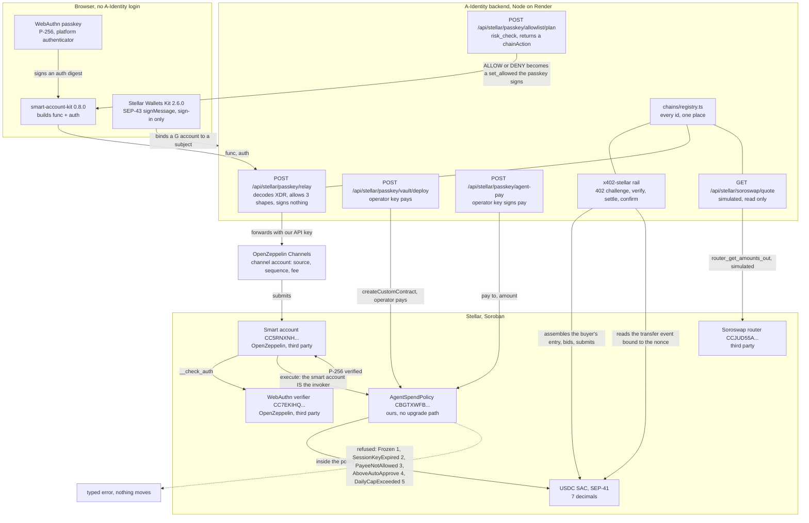
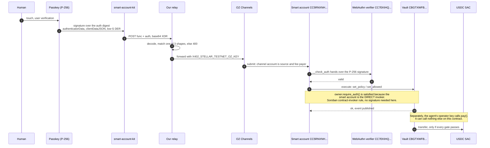
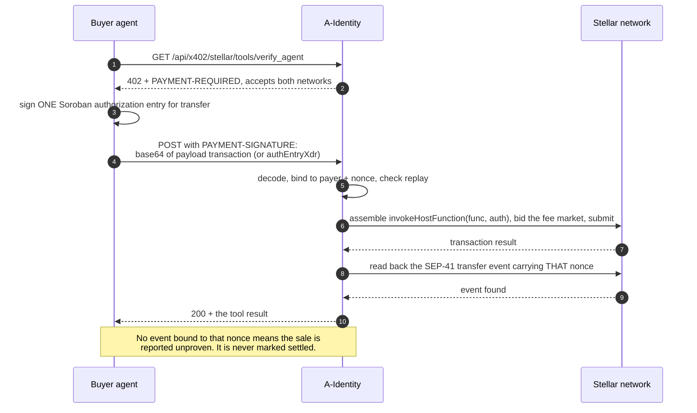

# A-Identity: Stellar Pro Hackathon 2026, Scale Track

Istanbul, 2026-09-19 to 2026-09-21. Submitted against the Scale Track, which asks for two
things beyond the usual deliverables: an accurate architecture diagram, and a
post-hackathon roadmap toward SCF and InstAward. Both are below, sections 4 and 9.

Live product: <https://a-identity.xyz> . Backend: <https://a-identity-backend.onrender.com> .
Stellar demo: <https://a-identity.xyz/stellar> . Artifact ledger: <https://a-identity.xyz/proof/stellar> .

Every identifier in this document is copied from `mcp/src/chains/registry.ts` or from a file
under `soroban/releases/`. Every transaction hash was re-read from Horizon on 2026-09-20
before it was written here. Where something is not done, the sentence says so and stops.

---

## 1. Why this exists

**The problem.** Software agents are starting to buy things. The moment an agent can move
money, someone has to answer two questions that no agent framework answers: who is the
counterparty, and what is this agent allowed to spend. Today both answers live in
application code. An API key is authority without a bound; a prompt instruction is a bound
without enforcement. If the agent is wrong, compromised, or simply looping, the only thing
between it and the balance is the same process that is misbehaving.

**What we build.** A passport and a bounded wallet for an AI agent. The passport is an
on-chain identity plus a verifiable claim that the agent controls its wallet. The wallet is
`AgentSpendPolicy`, a Soroban contract that holds the money and refuses payments that break
the policy a human set: a daily cap, a per-payment ceiling, a payee allowlist, a session-key
expiry and a freeze. The refusal happens on the ledger, with a typed error, before any
transfer executes. The server is a pre-check, not the authority.

**Who it is for.** Two users, and they are not the same person.

- The human who funds an agent and wants a ceiling that survives their own software being
  wrong. They set the policy and hold the key that can change it.
- The agent, which needs to pay for things at machine speed without holding the key that
  can lift its own limits. It holds an operator key that can call exactly one function.

**Why it is worth solving on Stellar.** Three properties of this chain do real work here,
and none of them is marketing:

1. `owner.require_auth()` does not care whether the owner is an account or a contract. When
   it is a contract, the host dispatches to that contract's `__check_auth`. That single
   protocol rule is what lets a WebAuthn passkey own a spend vault with no seed phrase
   anywhere in the story. Section 4 draws the chain of custody it produces.
2. A Soroban authorization entry is signed for one specific call, not for a whole
   transaction. So a buyer can pay for an API call while holding zero XLM: they sign the
   entry, we assemble, bid the fee and submit. Our x402 rail is built on exactly that, and
   the gasless claim is a number a third party can look up on Horizon rather than a phrase.
3. Native Circle USDC as a SEP-41 Stellar Asset Contract, with deterministic finality once
   a ledger closes and a settlement that the ledger charged us 23,479 stroops for.

**The value proposition, stated narrowly enough to be checkable.** A limit you set is
enforced by a contract rather than by our server, and a payment is never reported as settled
until the transfer event bound to that exact authorization nonce has been read back off the
ledger. Both halves are on chain and both halves have refusals on record, not only successes.

---

## 2. What was built in the hackathon window, and what already existed

The window is **2026-09-19 to 2026-09-20**. The separation below is the commit log, not a
recollection: `git log --since=2026-09-19` returns exactly eight commits.

### Built in the window

| What | Where | Commit |
| --- | --- | --- |
| A spend vault whose **owner is a WebAuthn passkey**, not a key: an OpenZeppelin smart account owns `CBGTXWFB...NS6J6U`, and it set its own policy, allowlisted a payee, and refused a revoked one on the ledger | `soroban/releases/testnet-passkey-owner-2026-09-19.json`, `mcp/src/stellar-passkey.ts`, `mcp/src/chains/stellar/relay.ts` | `327d640f` |
| A **fee-sponsoring relay**: `POST /api/stellar/passkey/relay` decodes the XDR, refuses everything outside three named shapes, and forwards the rest to OpenZeppelin Channels, which sources and pays. A person holding a passkey needs no XLM and no account | `mcp/src/http/stellar-passkey-routes.ts` | `327d640f` |
| `/stellar`, a **visitor-run demo**: five cards that create a passkey, deploy a vault it owns, run the risk check, write the verdict on chain and then settle one payment and get refused on another | `src/routes/Stellar.tsx`, `src/lib/stellar/passkey.ts` | `3e52b7cc` |
| The release record and the diagram for the above | `ARCHITECTURE.md`, `README.md`, `docs/chains/stellar.mdx` | `2d8fadec` |
| Passkey relying-party pinned, `@creit.tech/stellar-wallets-kit` pinned to 2.6.0 and `smart-account-kit` to 0.8.0 | `package.json`, `src/lib/stellar/passkey.ts` | `92fa6396` |
| **SEP-1 `stellar.toml`**, including an explicit statement of what it does not claim | `public/.well-known/stellar.toml` | `80a338c9` |
| **x402 canonical-carrier interop**: the rail now accepts the `{ transaction }` payload a stock `@x402/stellar` client sends under `PAYMENT-SIGNATURE`, reads the authorization entry out of the envelope and discards the rest, alongside the older `{ authEntryXdr }` | `mcp/src/x402-stellar/settle.ts` | `5ca661d5` |
| **Soroswap live quote**: `GET /api/stellar/soroswap/quote` simulates `router_get_amounts_out` against the live testnet router and returns what a swap would cost | `mcp/src/soroswap.ts`, `mcp/src/http/soroswap-routes.ts` | `9c0c4831` |

### Already existed before the window

Stated so that nothing above is read as bigger than it is.

- **`AgentSpendPolicy` on Stellar testnet** since 2026-08-15 (`CAIL6ECR...OEB4UI`) and on
  **pubnet** since 2026-08-24 (`CB5LYXFK...KWSYP`), same wasm hash byte for byte. On pubnet
  an agent spent exactly its 1 USDC daily budget and the next payment was refused with the
  contract's own `DailyCapExceeded`.
- **The self-facilitated Soroban x402 rail**, selling four tools on both networks, with the
  first pubnet sale on 2026-08-27 (`f213371c...`, ledger 64155370) and two more since.
- **Stellar Wallets Kit sign-in** (SEP-43 `signMessage` wallet proof), shipped 2026-09-09.
- **`mcp/src/cctp-stellar.ts`**, Circle CCTP V2 driven directly in both directions, proven
  on testnet on 2026-09-10.
- **Console vault flow**: live vault reads and prepared owner calls the owner signs with
  their own wallet, shipped 2026-09-15.

The honest summary of the window: the passkey-owned vault and its sponsored relay are new
work on top of a vault and a rail that were already carrying real money.

---

## 3. Ecosystem fit

### What we can honestly claim from the SCF Integration List

| Partner | Status | How load-bearing | Evidence |
| --- | --- | --- | --- |
| **Circle CCTP** | Written and **testnet-proven both directions**. Not exercised for this event. | Highest of the three, but as roadmap rather than as demo. It is the building block section 9 asks SCF to fund. | `mcp/src/cctp-stellar.ts`; inbound `32a09568...` ledger 4607724, outbound `b5766784...` ledger 4607728, both 2026-09-10. Live status: `GET /api/cctp/stellar/status` reports `mainnetAllowed: false` and `CCTP_EVM_SIGNER_KEY` unconfigured. |
| **Soroswap** | Live **read-only quote**. Executes nothing. | Low, and deliberately so. `AgentSpendPolicy` has no swap entrypoint and no upgrade path, so executing a swap under the policy would mean a new wasm and a third vault. | `GET /api/stellar/soroswap/quote` answers live off router `CCJUD55A...ZE7BRD`. Every response carries `integration.executes: false` and the reason. |
| **Stellar Wallets Kit** | **Sign-in only**, version 2.6.0. | Medium for the product, low for this demo. It binds a Stellar wallet to an A-Identity subject through a SEP-43 `signMessage` proof. It does not sign vault transactions today: the passkey flow uses `smart-account-kit` instead. | `src/lib/stellar/kit.ts`, `mcp/src/wallet-proof.ts`. |

Nothing else on the eligible list is integrated. DeFindex, Aquarius, Stellar Broker,
Allbridge, Privy, DFNS, Bridge and BlindPay have zero lines of code in this repository.
**NEAR Intents** is on the list and we have used it exactly once, operationally: a
market-maker swap that funded our Base wallets out of Stellar pubnet USDC, recorded as a
caveat on `/proof/base`. That is a transaction we made, not an integration we built, and it
is not claimed as one.

### The integration that is deepest and is not eligible

**OpenZeppelin is not on the SCF Integration List, and it is our deepest Stellar
integration.** Three separate OpenZeppelin products carry the headline feature: the Stellar
smart account contract, the WebAuthn verifier it calls in `__check_auth`, and Channels, the
relayer that sponsors the fee. Removing them removes the passkey story entirely. We say this
here rather than quietly counting it toward an integration score it does not qualify for.

### No anchor, and that is a scope decision

**We did not build an anchor or any local-payments integration.** No SEP-6, no SEP-24, no
SEP-31, no SEP-38, no fiat on-ramp or off-ramp, no KYC server. The rubric weights anchors
highest in this category and we are choosing to lose those points rather than dress a wallet
integration up as one.

The reason is structural rather than a matter of time. A-Identity never touches fiat: an
agent's budget arrives as USDC and leaves as USDC, and every party in the flow is a wallet
or a contract. Building an anchor would mean acquiring a banking relationship and a
compliance surface for a leg of the journey our product does not have. `stellar.toml` says
the same thing in the file itself, listing the absent fields by name so that no client can
discover them by trying.

---

## 4. Technical implementation

### 4.1 The architecture as the code actually is



Five things in that picture are worth reading closely, because each is a place a diagram
could have been drawn wrong.

1. **The relay is ours and it is between the browser and Channels.** The kit does not talk
   to OpenZeppelin directly. It posts `{ func, auth }` to us, we decode the XDR and refuse
   anything outside three shapes (a `createContractV2` of exactly the smart-account wasm the
   registry names; an owner entrypoint on a vault this server operates; or a smart account's
   `execute()` whose target is such a vault and whose `target_fn` is an owner entrypoint),
   and only then do we forward with our API key. `pay` is explicitly not relayable: it is
   the operator's call and the server signs it itself.
2. **The vault deploy is paid by our operator key, not by Channels.** Channels sponsors the
   visitor's writes. Creating the vault is our write, and the diagram gives it its own edge.
3. **Soroswap has no arrow into the vault.** It is a simulation against a third party's
   router that signs nothing and moves nothing. Drawing it as part of the payment path would
   be the single easiest way to make this diagram a lie.
4. **The registry is not a box in the flow, it is a constraint on it.** A test generates a
   forbidden list from `chains/registry.ts` and fails the build if any other file under
   `mcp/src` restates a chain id, an RPC or explorer host, or a token address.
5. **Stellar Wallets Kit is on the diagram but off the payment path.** It proves a `G...`
   account belongs to a signed-in subject. It does not sign a vault call.

### 4.2 The chain of custody, which is the claim



The human never holds a seed phrase, never funds an account, and never pays a fee. The agent
holds a key that can call `pay(to, amount)` and nothing else: `set_policy`, `set_allowed`,
`set_frozen`, `set_session_key_expiry`, `withdraw` and `owner_pay` all route through
`require_owner`, and the owner is the smart account.

`AgentSpendPolicy` has `set_operator` and deliberately **no `set_owner`**. The owner is
permanent. That is why proving a passkey can own a vault meant deploying a second vault
rather than migrating the first, and it is also the honest cost: one passkey is one signer,
no recovery signer was added, and a lost passkey is a balance nobody can withdraw.

### 4.3 The x402 rail



Three properties of this rail that the EVM rails do not have, and one they do:

- **No domain proving step.** An EIP-3009 token carries its own EIP-712 domain that has to
  be proven against the live separator. Soroban fixes the authorization preimage at the
  protocol level, so there is nothing per-token to prove. Its absence is a property of the
  chain, not an unfinished job.
- **The buyer pays no network fee**, and that is a measured claim: Horizon records the fee
  against our fee payer. It still needs XLM to exist at all, 1 for the account reserve and
  0.5 per trustline, which no rail can remove.
- **We absorb the settlement cost rather than charging it**, and we publish the arithmetic
  live rather than asserting it is negligible. `GET /api/x402/stellar/status` prices the
  last charged fee against the XLM/USDC order book on the same ledger. Read on 2026-09-20,
  one pubnet settlement was about 0.00045 USD, roughly 45 percent of the cheapest tool at
  0.001 USD, with a break-even XLM price of 0.4259 USD. Those first two move with the order
  book between one call and the next, which is why the endpoint is the number and this
  paragraph is only the reasoning.
- **Same as every rail**: nothing counts as settled without reading the transfer back
  ourselves, whoever broadcast it.

### 4.4 Verification

- Backend unit suite: over 1,380 tests across 95 colocated `*.test.ts` files, run with
  `cd mcp && npm test` (TypeScript compile plus `node:test`). The exact count is not quoted
  here because it moves with every commit: the literal in `mcp/src/asp/proof.ts` is the
  number, and a test fails the build if it stops matching the number of `test()`
  declarations.
- The Soroban contract has a negative-control runner: each guard is deleted in turn and the
  suite is required to go red. That is not an audit and this project does not call it one.
- The registry has a test that fails the build if a chain id, RPC host, explorer host or
  token address is hardcoded anywhere under `mcp/src` outside `chains/`.

---

## 5. Contract ids and deployed artifacts

Every id below is copied from `mcp/src/chains/registry.ts` or from a file under
`soroban/releases/`. The Soroswap factory and pair are read back out of the router at call
time rather than stored, which is why they cannot drift from it.

### Stellar pubnet (`stellar:pubnet`, registry status `live`)

| What | Id | Ours? | Explorer |
| --- | --- | --- | --- |
| `AgentSpendPolicy` vault | `CB5LYXFKKTKDDSCM6JO6C4GNRQUFBGSLYDET6Q56JNFJQSMBKH6KWSYP` | ours | [stellar.expert](https://stellar.expert/explorer/public/contract/CB5LYXFKKTKDDSCM6JO6C4GNRQUFBGSLYDET6Q56JNFJQSMBKH6KWSYP) |
| USDC, SEP-41 SAC | `CCW67TSZV3SSS2HXMBQ5JFGCKJNXKZM7UQUWUZPUTHXSTZLEO7SJMI75` | Circle | [stellar.expert](https://stellar.expert/explorer/public/contract/CCW67TSZV3SSS2HXMBQ5JFGCKJNXKZM7UQUWUZPUTHXSTZLEO7SJMI75) |
| CCTP TokenMessengerMinter | `CAE2G5Z77UP7GYPYGFOWFGW7C7J6I4YP2AFGSADRKQY62SYUFLPNFTXL` | Circle | [stellar.expert](https://stellar.expert/explorer/public/contract/CAE2G5Z77UP7GYPYGFOWFGW7C7J6I4YP2AFGSADRKQY62SYUFLPNFTXL) |
| CCTP MessageTransmitter | `CACMENFFJPJMSDAJQLX4R7K3SFZIW2LJSE3R2UMLGSWHFHS353FVXAZV` | Circle | [stellar.expert](https://stellar.expert/explorer/public/contract/CACMENFFJPJMSDAJQLX4R7K3SFZIW2LJSE3R2UMLGSWHFHS353FVXAZV) |
| CCTP CctpForwarder | `CBZL2IH7F6BIDAA3WBNXYKIXSATJGMSW7K5P5MJ6STX5RXN47TZJDF5T` | Circle | [stellar.expert](https://stellar.expert/explorer/public/contract/CBZL2IH7F6BIDAA3WBNXYKIXSATJGMSW7K5P5MJ6STX5RXN47TZJDF5T) |
| TrionLabs Stellar-8004 Identity | `CBGPDCJIHQ32G42BE7F2CIT3YW6XRN5ED6GQJHCRZSNAYH6TGMCL6X35` | third party, read only | [stellar.expert](https://stellar.expert/explorer/public/contract/CBGPDCJIHQ32G42BE7F2CIT3YW6XRN5ED6GQJHCRZSNAYH6TGMCL6X35) |

Pubnet accounts, published in `public/.well-known/stellar.toml`: owner
`GARC7OFBBQCZJ5N3LCI7HTTYJ2MMPDAFDNGIHSQMZ7EPJ5EAWQJ5R6I5` (2-of-3 multisig since
2026-08-25), operator `GDLAJM25YQRTIZOVZPVEM2GJ6L2I4OTZGY3HAWX3HGMPV7SM3QZONO4S`, x402 fee
payer `GAFVDEN6BC52WWPRPINOVENMXW3FU4LCSVVVA5C67RLPG4GAK6BE4SXY`.

### Stellar testnet (`stellar:testnet`, registry status `beta`)

| What | Id | Ours? | Explorer |
| --- | --- | --- | --- |
| `AgentSpendPolicy`, account owner | `CAIL6ECRAB5FUURQ54R7OTZPXRRCDO2S353YT6N6UZUWIBDG2ZOEB4UI` | ours | [stellar.expert](https://stellar.expert/explorer/testnet/contract/CAIL6ECRAB5FUURQ54R7OTZPXRRCDO2S353YT6N6UZUWIBDG2ZOEB4UI) |
| `AgentSpendPolicy`, **passkey owner** | `CBGTXWFBYAOZBR6EN3UK4PTLUAY6BRV2C36D3DPOTE5JSOLQXANS6J6U` | ours | [stellar.expert](https://stellar.expert/explorer/testnet/contract/CBGTXWFBYAOZBR6EN3UK4PTLUAY6BRV2C36D3DPOTE5JSOLQXANS6J6U) |
| `AgentSpendPolicy`, sponsored run | `CCV2MMK4WFJJVYITOWAH6Z3OW5RW7MYOYB3WGOZJ54NEL4PIJHV3KA7T` | ours | [stellar.expert](https://stellar.expert/explorer/testnet/contract/CCV2MMK4WFJJVYITOWAH6Z3OW5RW7MYOYB3WGOZJ54NEL4PIJHV3KA7T) |
| OpenZeppelin smart account (direct run) | `CC5RNXNHKKPAHFP5YEOTZDFOQDQVC6AQKX3EH3W6QKFKGVBAXPVM3RWA` | our instance, their code | [stellar.expert](https://stellar.expert/explorer/testnet/contract/CC5RNXNHKKPAHFP5YEOTZDFOQDQVC6AQKX3EH3W6QKFKGVBAXPVM3RWA) |
| OpenZeppelin smart account (sponsored run) | `CC2GS57AI3DZUVD5UBZ7ZFKVKUDZGXU56AICTYOXISGVJMLUQK2CJVVO` | our instance, their code | [stellar.expert](https://stellar.expert/explorer/testnet/contract/CC2GS57AI3DZUVD5UBZ7ZFKVKUDZGXU56AICTYOXISGVJMLUQK2CJVVO) |
| OpenZeppelin WebAuthn verifier | `CC7EKIHQP3TN4CARQDND6CEOY2UXLWWC2X5GHTD5NLAT7BG5GPZIOM3F` | third party | [stellar.expert](https://stellar.expert/explorer/testnet/contract/CC7EKIHQP3TN4CARQDND6CEOY2UXLWWC2X5GHTD5NLAT7BG5GPZIOM3F) |
| OpenZeppelin ed25519 verifier | `CAAVTMCBXEIBPR64EAASKFXERVPYFZA2JYP5A3BG6PESWEFUJX5IHKN4` | third party | [stellar.expert](https://stellar.expert/explorer/testnet/contract/CAAVTMCBXEIBPR64EAASKFXERVPYFZA2JYP5A3BG6PESWEFUJX5IHKN4) |
| USDC, SEP-41 SAC | `CBIELTK6YBZJU5UP2WWQEUCYKLPU6AUNZ2BQ4WWFEIE3USCIHMXQDAMA` | Circle | [stellar.expert](https://stellar.expert/explorer/testnet/contract/CBIELTK6YBZJU5UP2WWQEUCYKLPU6AUNZ2BQ4WWFEIE3USCIHMXQDAMA) |
| XLM SAC (quote leg only) | `CDLZFC3SYJYDZT7K67VZ75HPJVIEUVNIXF47ZG2FB2RMQQVU2HHGCYSC` | native | [stellar.expert](https://stellar.expert/explorer/testnet/contract/CDLZFC3SYJYDZT7K67VZ75HPJVIEUVNIXF47ZG2FB2RMQQVU2HHGCYSC) |
| Soroswap router | `CCJUD55AG6W5HAI5LRVNKAE5WDP5XGZBUDS5WNTIVDU7O264UZZE7BRD` | third party | [stellar.expert](https://stellar.expert/explorer/testnet/contract/CCJUD55AG6W5HAI5LRVNKAE5WDP5XGZBUDS5WNTIVDU7O264UZZE7BRD) |
| Soroswap factory (read out of the router) | `CDP3HMUH6SMS3S7NPGNDJLULCOXXEPSHY4JKUKMBNQMATHDHWXRRJTBY` | third party | [stellar.expert](https://stellar.expert/explorer/testnet/contract/CDP3HMUH6SMS3S7NPGNDJLULCOXXEPSHY4JKUKMBNQMATHDHWXRRJTBY) |
| Soroswap USDC/XLM pair (read out of the router) | `CCBX3NZTCQLQFSPG7HBOKL4P2RVPOPVFHDNRTOSCCJWBTPL2GHEH7RQS` | third party | [stellar.expert](https://stellar.expert/explorer/testnet/contract/CCBX3NZTCQLQFSPG7HBOKL4P2RVPOPVFHDNRTOSCCJWBTPL2GHEH7RQS) |
| CCTP TokenMessengerMinter | `CDNG7HXAPBWICI2E3AUBP3YZWZELJLYSB6F5CC7WLDTLTHVM74SLRTHP` | Circle | [stellar.expert](https://stellar.expert/explorer/testnet/contract/CDNG7HXAPBWICI2E3AUBP3YZWZELJLYSB6F5CC7WLDTLTHVM74SLRTHP) |
| CCTP MessageTransmitter | `CBJ6MTCKKZG73PMDZCJMSFRD7DQEMI4FKDH7CGDSV4W6FHCRBCQAVVJY` | Circle | [stellar.expert](https://stellar.expert/explorer/testnet/contract/CBJ6MTCKKZG73PMDZCJMSFRD7DQEMI4FKDH7CGDSV4W6FHCRBCQAVVJY) |
| CCTP CctpForwarder | `CA66Q2WFBND6V4UEB7RD4SAXSVIWMD6RA4X3U32ELVFGXV5PJK4T4VSZ` | Circle | [stellar.expert](https://stellar.expert/explorer/testnet/contract/CA66Q2WFBND6V4UEB7RD4SAXSVIWMD6RA4X3U32ELVFGXV5PJK4T4VSZ) |
| TrionLabs Stellar-8004 Identity (we are agent 25) | `CDE3K4COIAGWNNJQQLL26SYI3KBJF5FUDHXG5FA6GYDJCG7T5V7FIWZH` | third party, read only | [stellar.expert](https://stellar.expert/explorer/testnet/contract/CDE3K4COIAGWNNJQQLL26SYI3KBJF5FUDHXG5FA6GYDJCG7T5V7FIWZH) |

### Code

`AgentSpendPolicy` wasm sha256 `155eb31c1867254eacbf1b7a4755164d15cc6b6f939644705ab6b8df61579239`,
11,625 bytes, identical on both networks. Built with rustc 1.96.0, `soroban-sdk =27.0.6`,
Stellar CLI 27.1.0, target `wasm32v1-none`. The binary is deliberately not committed,
because Rust wasm is not bit-reproducible across machines by default: pull it with
`stellar contract fetch` and sha256 it yourself.

OpenZeppelin smart account wasm hash
`1b5f4534a76322da2ad7c745f6900857a6802b0ca79850c35a03561df997785a`, taken from
`smart-account-kit` 0.8.0's own deployment manifest. Third party. We did not build it and we
do not vouch for it beyond having deployed an instance of it.

### Transactions worth opening

Re-read from Horizon on 2026-09-20; the ledger is the source, not this table.

| What | Network | Hash | Result |
| --- | --- | --- | --- |
| Smart account deployed, one WebAuthn signer | testnet | `dcd3c4227b0a773bf3d825a8fb0c5d37196b9cb7366377bf8a2c76162d3d914c` | success, ledger 4760408 |
| Vault instantiated, owner = the smart account | testnet | `ccac0b30612a216deea7d84035cac3e3acbb5884c827f60065ed33ff61729fd2` | success, ledger 4760409 |
| `set_policy` signed by the passkey | testnet | `994b5cb92c5dee9ce733109e9b7cecd35625aeb3b3edc35903a22cc93a0dd758` | success, ledger 4760411 |
| **Payment refused ON THE LEDGER** with `PayeeNotAllowed` | testnet | `22b33018c807946df066365bde2a72293372bf7768ab96688acb623c290357a0` | **failed**, ledger 4760421, fee 15913 stroops, `Error(Contract, #3)` |
| Smart account deployed with the fee **sponsored by Channels** | testnet | `9df1bbb1d29e623bcdce1dc8919f0f8add4941e148e390d789d80a755b795b32` | success, ledger 4764131 |
| Sponsored run ends in a settled 0.05 USDC payment | testnet | `8590694194da891361734f541042870e1a297f829a0fc701c82b988c34a23410` | success, ledger 4764146 |
| First x402 sale on **mainnet**, 0.001 USDC, buyer paid no fee | pubnet | `f213371c1241968ee78170923d8c5a3bd9b32950e73bb9c563d800ab2c70ec9e` | success, ledger 64155370 |
| First mainnet agent payment under the vault policy | pubnet | `c4a884c306ee0cd76b7fb4fa245176618897687ad7fee724e2d43b72d20f3733` | success, ledger 64103478 |
| Production pubnet sale from the dedicated fee payer | pubnet | `43a97d67dad5f90a4c8dff703fb07bd9b5f17503201ffb37d5168b08bd12b2b4` | success, ledger 64432240 |
| Gasless x402 sale, testnet | testnet | `6d87799242b9fb36a26ac6f2d2fb11c5e7fb8bdd52bc6cf0471dcc8a8caba09c` | success, ledger 4149194 |
| CCTP inbound, minted through the forwarder | testnet | `32a09568d56bb0f0eeda54b6529f8756cc1e7e60e0bc235e914aec0898dd1fa2` | success, ledger 4607724 |
| CCTP outbound, burned here for an Arc signer | testnet | `b5766784c5409a877ae28039182824978dd306c147a30d469b7f3fdc204dd458` | success, ledger 4607728 |

---

## 6. What is live, and what is not

| Thing | Status | The exact claim |
| --- | --- | --- |
| `AgentSpendPolicy` on pubnet | **live, real money, small money** | 1 USDC per UTC day, 0.25 USDC per payment, both fixed at construction and unchangeable. The balance is a live read, not a figure to quote: `GET /api/stellar/vaults` reports it. The cap is the deliberate loss ceiling for an unaudited contract, and nothing here shows behaviour at a size anyone would mind losing. |
| `AgentSpendPolicy` on testnet | **beta** | Test money. Stellar testnet is reset periodically, so anything here is a rehearsal and never a record. |
| Passkey-owned vault | **testnet only** | No passkey-owned vault exists on pubnet. The pubnet smart-account constants are deliberately not recorded in the registry. |
| The passkey in the recorded run | **software P-256** | It was generated inside the spike process, standing in for a platform authenticator. Same verifier contract, same signature format, different custody. Nothing in that record proves a real authenticator's user-verification flow. |
| x402 rail, testnet | **live and selling** | `broadcasterReady: true`, four tools, buyer pays no fee. |
| x402 rail, pubnet | **live and selling** | Three sales, all with our payer and our payee. That is evidence the rail works, not evidence of demand, and the proof page labels them internal. |
| **The public `/stellar` relay** | **prepared, not executing** | `GET /api/stellar/passkey/status` reports `relayer.keyConfigured: false`. Production has **`X402_STELLAR_TESTNET_OZ_KEY`** unset, so `POST /api/stellar/passkey/relay` answers HTTP 501 with `outcome: "prepared"` and the exact body it would have posted to Channels, and forwards nothing. Setting that one variable on Render closes it. |
| **The public `/stellar` vault deploy and agent payment** | **prepared, not executing** | Same status endpoint reports `operator.configured: false`. **`STELLAR_TESTNET_SIGNER_SECRET`** is unset in production, so `POST /api/stellar/passkey/vault/deploy` returns the exact `__constructor` call it would make and submits nothing. The sponsored run recorded in section 5 was produced with both variables set, locally. |
| Soroswap quote | **live, read only** | Answers now, off the live router. `executes: false` in every response. |
| CCTP between Stellar and EVM | **written, testnet-proven, not exercised for this event** | `GET /api/cctp/stellar/status` reports `mainnetAllowed: false` and `CCTP_EVM_SIGNER_KEY` unconfigured. Executing also needs the caller's session subject in `CCTP_BRIDGE_OPERATORS`. |
| Identity on Stellar | **not anchored** | ERC-8004 is EVM-only and nothing bridges it. A Stellar agent's passport is bridged from an EVM chain, and KYA cannot be anchored on Stellar at all. TrionLabs' Stellar-8004 registry is read, read-only and labeled theirs. |
| Audit | **none** | Free tooling we can re-run, an adversarial review that found and fixed real defects, and a negative-control runner. None of that is an audit and we do not call it one. The OpenZeppelin kit says of itself that it is unaudited, and we repeat that rather than improve on it. |
| Recovery | **none** | One passkey is one signer, no recovery signer was added, and `AgentSpendPolicy` has no `set_owner`. A lost passkey is a balance nobody can withdraw. |

---

## 7. How a judge evaluates this in ten minutes

Every command below was run against production on 2026-09-20 before it was written here.
Nothing needs a key, a wallet or an install beyond `curl`.

**Minute 1. The vaults, read live off the ledger.** One call proves the headline: a vault
whose owner is a contract, not an account.

```sh
curl -s https://a-identity-backend.onrender.com/api/stellar/vaults
```

Three vaults come back with live state. The entry for `CBGTXWFB...` reports
`"ownerKind": "smart-account"` and `"owner": "CC5RNXNH..."`. That is the passkey-owned vault:
its owner is a Soroban contract id, which is only possible because `owner.require_auth()`
dispatches to `__check_auth`. It also shows the pubnet vault at a 1 USDC daily cap holding
real Circle USDC.

**Minute 2. The refusal, on the ledger, from Stellar's own API rather than ours.**

```sh
curl -s https://horizon-testnet.stellar.org/transactions/22b33018c807946df066365bde2a72293372bf7768ab96688acb623c290357a0 \
  | python3 -c "import sys,json;d=json.load(sys.stdin);print(d['successful'],d['ledger'],d['fee_charged'])"
```

Prints `False 4760421 15913`. A payment that was included in a ledger and refused by the
contract with `Error(Contract, #3)`, `PayeeNotAllowed`, because the owner revoked the payee
between the moment the agent signed and the moment the ledger applied it. On Soroban a
refused payment normally fails in simulation and leaves no transaction at all; this one had
to be manufactured by tightening the policy mid-flight, and
`soroban/releases/testnet-passkey-owner-2026-09-19.json` explains exactly how under
`howTheRefusalGotAHash`.

**Minute 3. The 402 challenge, on both networks.**

```sh
curl -s https://a-identity-backend.onrender.com/api/x402/stellar/tools/verify_agent
```

HTTP 402 with an `accepts` array carrying `stellar:testnet` and `stellar:pubnet`, each with
its own SEP-41 SAC, its own `payTo` and 7 decimals. The `tool.payment` field is the
in-window interop work in one sentence: a stock `@x402/stellar` client sends
`payload: { transaction }` under `PAYMENT-SIGNATURE` and needs no change to pay here; the
older `payload: { authEntryXdr }` still works.

**Minute 4. What a settlement costs us, priced on the ledger it settles on.**

```sh
curl -s https://a-identity-backend.onrender.com/api/x402/stellar/status
```

Under `economics`, both networks are priced live against the XLM/USDC order book on Horizon,
with the fee the ledger last actually charged. This is the answer to "is gasless free": no,
it costs us about 45 percent of the cheapest tool on pubnet, we absorb it deliberately, and
`breakEvenXlmUsd` names the price at which that decision gets revisited.

**Minute 5. The Soroswap quote, live and labeled as a quote.**

```sh
curl -s https://a-identity-backend.onrender.com/api/stellar/soroswap/quote
```

One XLM in, USDC out, simulated against router `CCJUD55A...` right now, with the factory and
pair read back out of the router in the same breath. `integration.executes` is `false` and
`whyNot` says the vault has no swap entrypoint.

**Minute 6. What the public demo can and cannot do today.**

```sh
curl -s https://a-identity-backend.onrender.com/api/stellar/passkey/status
```

`relayer.keyConfigured: false` and `operator.configured: false`. The endpoint says in its own
words that `X402_STELLAR_TESTNET_OZ_KEY` is unset, so the relay validates and returns what it
would post and forwards nothing. This is section 6's gap, reported by the server rather than
by us.

**Minute 7. The SEP-1 file, including what it refuses to claim.**

```sh
curl -s https://a-identity.xyz/.well-known/stellar.toml
```

Three pubnet accounts in the order money moves through them, and a comment block naming
every anchor field that is absent and why.

**Minute 8. The artifact ledger.**

```sh
curl -s https://a-identity-backend.onrender.com/api/proof/stellar
```

Both networks, every transaction we claim, and a `caveats` array a test forces to be
non-empty. Human version: <https://a-identity.xyz/proof/stellar> .

**Minutes 9 and 10. The demo itself.** <https://a-identity.xyz/stellar> , five cards in the
order the 90-second demo runs. With the two environment variables above unset it will show
you the prepared calls rather than land them, which is the same honesty the API reports.
The version that did land is recorded end to end in
`soroban/releases/testnet-passkey-owner-2026-09-19.json`, including the run where
OpenZeppelin Channels paid every fee.

---

## 8. Stellar skill files used

The Stellar work here was written with [`kaankacar/stellar-build`](https://github.com/kaankacar/stellar-build)
installed. That bundle does not redistribute the Stellar knowledge modules; it fetches them
from their canonical upstreams at install time and drops them at the paths below. The list is
restated from README.md, including the two entries that name what was **not** used, because
naming what you read past is part of the citation.

Used:

- [`skills/soroban/SKILL.md`](https://github.com/stellar/stellar-dev-skill/blob/9abdab805d62/skills/soroban/SKILL.md) (the `AgentSpendPolicy` contract in `soroban/contracts/agent-spend-policy`: storage choices, the single `require_auth` line, typed errors, instance TTL)
- [`skills/smart-contracts/SKILL.md`](https://github.com/stellar/stellar-dev-skill/blob/main/skills/smart-contracts/SKILL.md) (the audit and negative-control discipline in `soroban/audit`, where each guard is deleted in turn and the suite is required to go red)
- [`skills/dapp/SKILL.md`](https://github.com/stellar/stellar-dev-skill/blob/main/skills/dapp/SKILL.md) (Stellar Wallets Kit sign-in in `src/lib/stellar/kit.ts`, and the passkey smart account flow behind the vault above)
- [`skills/agentic-payments/SKILL.md`](https://github.com/stellar/stellar-dev-skill/blob/main/skills/agentic-payments/SKILL.md) (the Soroban x402 rail in `mcp/src/x402-stellar`, where the buyer signs an authorization entry and pays no network fee)
- [`skills/data/SKILL.md`](https://github.com/stellar/stellar-dev-skill/blob/main/skills/data/SKILL.md) (the RPC and Horizon reads in `mcp/src/chains/stellar`, including read failover and turning a ledger TTL into a date)
- [`skills/assets/SKILL.md`](https://github.com/stellar/stellar-dev-skill/blob/main/skills/assets/SKILL.md) (SAC derivation on both networks and the trustline handling every classic payee needs)
- [`skills/cross-chain/SKILL.md`](https://github.com/stellar/stellar-dev-skill/blob/main/skills/cross-chain/SKILL.md) (CCTP between Stellar and EVM in `mcp/src/cctp-stellar.ts`: domain 27 and the `CctpForwarder` a Stellar recipient requires)

Not used, and why:

- [`skills/stellar-anchor-skill/SKILL.md`](https://github.com/CheesecakeLabs/stellar-anchor-skill/blob/main/SKILL.md) (no anchor built)
- [`skills/zk-proofs/SKILL.md`](https://github.com/stellar/stellar-dev-skill/blob/main/skills/zk-proofs/SKILL.md) (no ZK circuit built)

Those two were read past rather than applied, for a structural reason rather than a matter of
time: this project operates no fiat on-ramp or off-ramp, so there is no anchor and no SEP-6,
SEP-24 or SEP-31 flow to build, and it proves nothing in zero knowledge, so there is no
circuit and no verifier contract. Two notes on the links: `soroban` is pinned to the revision
installed here because upstream has since split that skill into `smart-contracts`, and the
anchor skill comes from Cheesecake Labs rather than from the same upstream as the rest.

---

## 9. Post-hackathon roadmap: SCF and InstAward

### 9.1 The facts we are planning against

Stated with their source so a reviewer can correct us rather than guess what we assumed.

- The current open round is **SCF #46**, submission deadline **2026-11-08**.
- You do not apply to a round directly. You submit a **rolling Interest Form** at
  communityfund.stellar.org and are then invited into a round.
- The **Integration Track** funds **25,000 to 150,000 USD** by scope. It **requires** an
  application carrying existing traction plus **at least one building block from the
  official SCF Integration List**.
- Its **final tranche, 40 percent, releases on a committed on-chain metric**, and the
  project's on-chain footprint (Soroban contract ids, issuing accounts, app wallets) is
  registered **at award time**. A modest credible number is explicitly preferred over an
  aggressive one.
- Calibration on size: the **median funded Build Award is 93,700 USD**, and **rejected
  submissions average 102,000 USD**. The instruction that follows from those two numbers is
  to ask low and specific.
- **InstAward** is **1,000 to 5,000 USD** initially with a **15,000 USD aggregate cap**, and
  it runs through **Stellar Ambassador Chapters** rather than through this hackathon.

### 9.2 Where A-Identity already stands against that

- **Traction exists and is on chain**, which is the part of an Integration Track application
  that is usually missing: a pubnet vault that has held and spent real USDC under an
  on-ledger policy since 2026-08-24, three pubnet x402 sales, and a testnet record of a
  passkey-owned vault that both settled and refused. The honest qualifier travels with it:
  every payer so far has been us.
- **The building block requirement is already satisfiable three ways.** Circle CCTP,
  Soroswap and Stellar Wallets Kit are all on the Integration List and all three are in this
  repository at the levels section 3 describes.
- **The on-chain footprint is already published**, which is what registration at award time
  will ask for: `public/.well-known/stellar.toml` names the three pubnet accounts and the
  vault contract, and `mcp/src/chains/registry.ts` is the machine-readable source behind it.
  We issue no asset, so there is no issuing account to register, and we will say that rather
  than leave the field blank.
- **A 5,000 USD InstAward was already taken in July 2026**, as one of thirteen Turkish teams
  in that cohort. That leaves **10,000 USD of headroom** under the 15,000 aggregate cap and
  **does not disqualify A-Identity from SCF**, which is a separate programme.

### 9.3 The proposed Integration Track application, built on Circle CCTP

**Why CCTP and not one of the other two.** Soroswap is a quote that executes nothing, and
Stellar Wallets Kit is sign-in. Neither is load-bearing enough to build a funded scope
around, and saying so is cheaper than discovering it in review. CCTP is different: the module
is written, it has crossed in both directions on testnet, and the gap between where it is and
where it needs to be is a specific, fundable piece of engineering rather than a research
project.

**The problem it solves for the product.** An agent's budget has to get onto Stellar. Today,
when we moved value between Stellar and an EVM chain for operational reasons, we used a NEAR
Intents market-maker swap, which is a custodial hop that we recorded as a caveat. CCTP is the
non-custodial version of that same hop: burn on the source, Iris attestation, native mint on
the destination, with a Stellar recipient routed through Circle's `CctpForwarder` in one
atomic call. Getting this right is unforgiving, because a Stellar recipient that is put in
the wrong field of a CCTP message is unrecoverable, and that is exactly the kind of detail a
funded integration should carry for the ecosystem rather than each team rediscovering.

**Proposed ask: 45,000 USD.** Low in the 25,000 to 150,000 band, well under the 93,700 median,
and matched to a scope that is three months of one engineer rather than a platform rebuild.

**Scope, in four deliverables:**

1. Take `cctp-stellar.ts` from testnet-proven to **pubnet-proven in both directions**, with
   receipts published in `provenance.ts` and served at `/proof/stellar` under the same rule
   as everything else: nothing counts as settled without reading it back.
2. **Cross-chain vault top-up**: fund a Stellar `AgentSpendPolicy` vault directly from USDC
   held on an EVM chain, so a human setting an agent's budget does not need to already hold
   USDC on Stellar. This is the feature, and the CCTP work is what makes it possible.
3. **Operator gating and caps as shipped policy**, not as a flag: executing a bridge stays
   behind `CCTP_BRIDGE_OPERATORS`, the EVM side behind `CCTP_EVM_SIGNER_KEY`, mainnet behind
   an explicit opt-in, and the amount behind `CCTP_STELLAR_MAX_USD`. Every write stays
   prepared-or-executed.
4. **A written integration guide for the Stellar side of CCTP**, covering the forwarder hook
   layout byte for byte and the 7-decimal against 6-decimal conversion, published from this
   repository. That is the part another team can use without adopting anything of ours.

**Draft tranche structure, 30 / 30 / 40:**

| Tranche | Share | Amount | Releases on |
| --- | --- | --- | --- |
| 1 | 30 percent | 13,500 USD | Award. Footprint registered: vault `CB5LYXFK...KWSYP`, accounts `GARC7OFB...`, `GDLAJM25...`, `GAFVDEN6...`, no issuing account. |
| 2 | 30 percent | 13,500 USD | Deliverables 1 and 3: a pubnet CCTP transfer in each direction, with hashes in `provenance.ts`, and the operator gate shipped and test-covered. |
| 3 | 40 percent | 18,000 USD | The on-chain metric below, measured over the six months after award. |

**Draft final-tranche metric.** One number, chosen to be modest and checkable rather than
impressive:

> **25 distinct external Stellar accounts have each settled at least one x402 purchase on
> `stellar:pubnet` against the registered footprint.**

An account is **external** when it is not on the internal-payer list this repository
hardcodes (`KNOWN_INTERNAL_PAYERS` in `mcp/src/x402-stellar/rail.ts`, plus the configured
`payTo` and fee payer of each network, derived live). That definition is already in the code
and already drives the `internal` label on the public proof page, so the metric cannot be
satisfied by us paying ourselves, and the measurement does not depend on us: every
settlement carries a transaction hash and a payer account that anyone can count off the
ledger.

Two supporting reads will be reported alongside it and will **not** gate the tranche, because
stacking three committed metrics is how a tranche becomes unreleasable:

- the number of pubnet CCTP transfers into or out of the registered contracts, and
- the number of distinct vaults deployed on pubnet with a non-A-Identity owner.

Today the honest baseline for the committed metric is **zero external payers**. Saying so is
the point: the tranche should measure a change we do not currently have, not restate one we
do.

### 9.4 InstAward, and what the ask on Lounge Day is

InstAward is not awarded through this hackathon. It runs through **Stellar Ambassador
Chapters**, so the correct ask on Lounge Day is **an introduction to a Chapter Lead**, not a
grant conversation. With 10,000 USD of headroom under the aggregate cap, the size we would
ask for is a **second 5,000 USD InstAward**, scoped to the piece of work that is community
output rather than product: deliverable 4 above, the written Stellar-side CCTP integration
guide, plus a workshop in Turkish for the Rise In and Stellar Turkiye cohort that the
July 2026 award already connected us to.

### 9.5 Sequence

| When | What |
| --- | --- |
| Week of 2026-09-22 | Submit the rolling SCF Interest Form. It is not round-bound, so this is not gated on the #46 deadline. |
| Lounge Day | Ask for a Chapter Lead introduction for InstAward. Separately, ask SDF whether the Integration Track reviewer would accept CCTP at "written and testnet-proven" as the qualifying building block, or wants pubnet first. That answer changes the tranche 1 boundary and is cheaper to ask than to assume. |
| Before 2026-11-08 | If invited into SCF #46, submit the Integration Track application at 45,000 USD with the tranche structure above. If not invited in time, the Interest Form stays rolling and the next round is the target; the work in 9.3 is not gated on the grant. |
| Independent of both | Deliverable 1 starts regardless. A pubnet CCTP transfer in each direction is a day of work plus the money to do it with, and it is the single thing that would most improve this submission if it had existed before 2026-09-21. |
