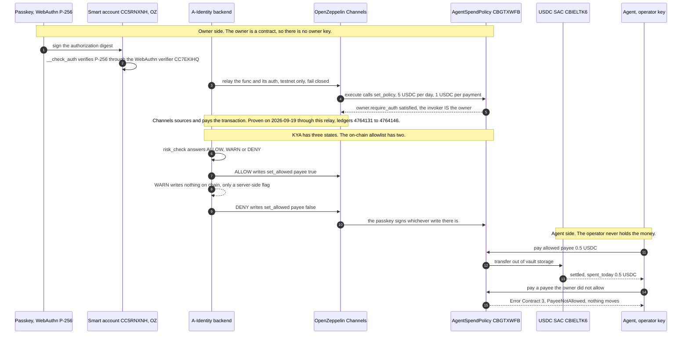

Stellar is the only chain here where the spend limit is enforced by a contract *before*
the payment exists, and the only one where a buyer pays for a trust check without holding
a single unit of gas. Both networks run the same wasm and the same rail code:
`stellar:pubnet` is `live`, `stellar:testnet` is `beta`.

## Why Stellar

<CardGroup cols={3}>
  <Card title="Native Circle USDC" icon="dollar-sign">
    Real USDC, issued by Circle, reachable from Soroban as a SEP-41 Stellar Asset Contract. Seven decimals, not the six every EVM USDC uses.
  </Card>
  <Card title="The buyer signs, not the transaction" icon="signature">
    A Soroban authorization ENTRY is signed for one specific `transfer` call. The seller assembles, pays the network fee and submits, so the buyer never touches a sequence number and never pays a stroop.
  </Card>
  <Card title="A policy the ledger enforces" icon="shield">
    `AgentSpendPolicy` is ours, written in Rust for Soroban rather than translated. A daily cap, an auto-approve ceiling, an allowlist, a freeze and a session-key expiry, with typed errors a client can branch on.
  </Card>
</CardGroup>

<Note>
  Stellar pubnet is **live**, and live has never meant "no caveats". Four of them, stated
  up front:

  - **Real money, but small money.** The pubnet vault's policy is 1 USDC per UTC day and
    0.25 USDC per payment, an order of magnitude under the testnet vault, because this one
    holds value.
  - **Both sides of every payment have been ours so far.** All three x402 sales on pubnet,
    one from an operator machine on 2026-08-27 and two through the hosted deployment, had
    our payer and our payee. That is evidence the rail works, not evidence of demand, and
    the proof page says so.
  - **The contract is not audited.** Free tooling we can re-run, an adversarial review that
    found and fixed real defects, and a negative-control runner that deletes each guard in
    turn and requires the suite to go red. None of that is an audit and this project does
    not call it one.
  - **No identity anchor.** ERC-8004 is EVM-only. A Stellar agent's passport is bridged
    from an EVM chain, and KYA cannot be anchored here at all.
</Note>

## Network config

| Field | `stellar:pubnet` (live) | `stellar:testnet` (beta) |
| --- | --- | --- |
| Passphrase | `Public Global Stellar Network ; September 2015` | `Test SDF Network ; September 2015` |
| Soroban RPC (primary) | `https://mainnet.sorobanrpc.com` | `https://soroban-testnet.stellar.org` |
| Soroban RPC (fallbacks) | `https://soroban-rpc.mainnet.stellar.gateway.fm`, `https://rpc.ankr.com/stellar_soroban` | `https://soroban-rpc.testnet.stellar.gateway.fm` |
| Horizon | `https://horizon.stellar.org` | `https://horizon-testnet.stellar.org` |
| Explorer | [stellar.expert (public)](https://stellar.expert/explorer/public) | [stellar.expert (testnet)](https://stellar.expert/explorer/testnet) |
| Native currency | XLM (7 decimals) | XLM (7 decimals) |
| USDC SAC | `CCW67TSZV3SSS2HXMBQ5JFGCKJNXKZM7UQUWUZPUTHXSTZLEO7SJMI75` | `CBIELTK6YBZJU5UP2WWQEUCYKLPU6AUNZ2BQ4WWFEIE3USCIHMXQDAMA` |
| USDC classic asset | `USDC:GA5ZSEJYB37JRC5AVCIA5MOP4RHTM335X2KGX3IHOJAPP5RE34K4KZVN` | `USDC:GBBD47IF6LWK7P7MDEVSCWR7DPUWV3NY3DTQEVFL4NAT4AQH3ZLLFLA5` |
| USDC decimals | 7 | 7 |
| CCTP domain | `27` | `27` |

Two properties of that table are worth stating rather than leaving implicit.

**The SAC id is derived, never pasted.** A Stellar Asset Contract id is a deterministic
function of the classic asset plus the network passphrase, which is why the same asset
code maps to a different contract on each network. Both ids above came out of
`stellar contract id asset` and were then read back live for `symbol()`, `decimals()` and
`name()`. On pubnet the issuer was checked first, because anyone may issue an asset called
USDC: `GA5ZSEJ...` publishes `circle.com` as its home domain, which is the SEP-1 binding
between an issuer and a company.

**Reads fail over across the RPC list; a `sendTransaction` never does.** A resubmitted
envelope answers `DUPLICATE` on the second host, and the rail would read that as a decided
refusal of a payment that is in fact in flight.

## What is deployed

| Contract | pubnet | testnet |
| --- | --- | --- |
| `AgentSpendPolicy` (ours) | [`CB5LYXFK...KWSYP`](https://stellar.expert/explorer/public/contract/CB5LYXFKKTKDDSCM6JO6C4GNRQUFBGSLYDET6Q56JNFJQSMBKH6KWSYP) | [`CAIL6ECR...OEB4UI`](https://stellar.expert/explorer/testnet/contract/CAIL6ECRAB5FUURQ54R7OTZPXRRCDO2S353YT6N6UZUWIBDG2ZOEB4UI) |
| `AgentSpendPolicy`, passkey-owned (ours) | testnet only | [`CBGTXWFB...NS6J6U`](https://stellar.expert/explorer/testnet/contract/CBGTXWFBYAOZBR6EN3UK4PTLUAY6BRV2C36D3DPOTE5JSOLQXANS6J6U) |
| OpenZeppelin smart account (third party) | testnet only | [`CC5RNXNH...VM3RWA`](https://stellar.expert/explorer/testnet/contract/CC5RNXNHKKPAHFP5YEOTZDFOQDQVC6AQKX3EH3W6QKFKGVBAXPVM3RWA) |
| OpenZeppelin WebAuthn verifier (third party) | testnet only | [`CC7EKIHQ...ZIOM3F`](https://stellar.expert/explorer/testnet/contract/CC7EKIHQP3TN4CARQDND6CEOY2UXLWWC2X5GHTD5NLAT7BG5GPZIOM3F) |
| USDC, SEP-41 SAC | [`CCW67TSZ...SJMI75`](https://stellar.expert/explorer/public/contract/CCW67TSZV3SSS2HXMBQ5JFGCKJNXKZM7UQUWUZPUTHXSTZLEO7SJMI75) | [`CBIELTK6...XQDAMA`](https://stellar.expert/explorer/testnet/contract/CBIELTK6YBZJU5UP2WWQEUCYKLPU6AUNZ2BQ4WWFEIE3USCIHMXQDAMA) |
| CCTP TokenMessengerMinter | `CAE2G5Z77UP7GYPYGFOWFGW7C7J6I4YP2AFGSADRKQY62SYUFLPNFTXL` | `CDNG7HXAPBWICI2E3AUBP3YZWZELJLYSB6F5CC7WLDTLTHVM74SLRTHP` |
| CCTP MessageTransmitter | `CACMENFFJPJMSDAJQLX4R7K3SFZIW2LJSE3R2UMLGSWHFHS353FVXAZV` | `CBJ6MTCKKZG73PMDZCJMSFRD7DQEMI4FKDH7CGDSV4W6FHCRBCQAVVJY` |
| CCTP CctpForwarder | `CBZL2IH7F6BIDAA3WBNXYKIXSATJGMSW7K5P5MJ6STX5RXN47TZJDF5T` | `CA66Q2WFBND6V4UEB7RD4SAXSVIWMD6RA4X3U32ELVFGXV5PJK4T4VSZ` |
| Stellar 8004 Identity (third party) | `CBGPDCJIHQ32G42BE7F2CIT3YW6XRN5ED6GQJHCRZSNAYH6TGMCL6X35` | `CDE3K4COIAGWNNJQQLL26SYI3KBJF5FUDHXG5FA6GYDJCG7T5V7FIWZH` |
| Stellar 8004 Reputation (third party) | `CBOIAIMMWAXI57OATLX6BWVDQLCC4YU55HV6MZXFRP6CBSGAMXSTEPPA` | `CBZEAGIEI3HXMDRLF44KLQJQQOH6LCYWWSGJVSYQYQO2HQ6DDGZ7HT55` |
| Stellar 8004 Validation (third party) | `CBT6WWEVEPT2UFGFGVJJ7ELYGLQAGRYSVGDTGMCJTRWXOH27MWUO7UJG` | `CC5USZRO26MOIAVNYTTJDS63C2OBBLREOAOET4CPF2EZWO3YFKLMO3SL` |

The vaults are ours. The USDC SACs are Circle's asset seen through Soroban. The CCTP
contracts are Circle's, and the registry cites the Circle page each row was read from. The
Stellar 8004 rows belong to TrionLabs: we **read** them, labeled third-party, and they are
not our anchor. See [Identity on Stellar](#identity-on-stellar-stated-plainly) below. The
two OpenZeppelin rows are theirs as well: the smart account instance is ours, the account
wasm and the WebAuthn verifier behind it are third-party testnet deployments we read out of
the `smart-account-kit` manifest rather than built or verified. See
[Passkey owner](#passkey-owner) below.

All three vaults carry the same wasm, sha256
`155eb31c1867254eacbf1b7a4755164d15cc6b6f939644705ab6b8df61579239`, byte for byte, so
pubnet runs the code that has been under test since the first testnet deploy rather than a
rebuild of it. The pubnet vault was deployed 2026-08-24, the first testnet vault
2026-08-15, and the passkey-owned testnet vault 2026-09-19.

## The spend vault

`AgentSpendPolicy` holds an agent's USDC and refuses anything the owner did not permit. It
has **no upgrade entrypoint and no `initialize`**: the constructor ran atomically at deploy
and its arguments are permanent. There has been no upgrade, no re-initialization and no
owner transfer on either network.

| | pubnet | testnet | testnet, passkey-owned |
| --- | --- | --- | --- |
| Daily cap (UTC day) | 1 USDC | 10 USDC | 5 USDC |
| Auto-approve ceiling per payment | 0.25 USDC | 2 USDC | 1 USDC |
| Owner | 2-of-3 multisig since 2026-08-25 | single key | a smart account with one passkey signer |

### The gate order, and why order is the product

The ladder runs in a fixed order, and the order is observable behaviour rather than an
implementation detail: an agent told `Frozen` when it expected `DailyCapExceeded` routes to
the wrong recovery path. Both entry points first refuse an invalid payee, the vault itself
or the settlement token. For an operator payment the ladder then runs amount, freeze,
session-key expiry, allowlist, auto-approve ceiling, daily cap, and finally balance.

That last pair is worth reading closely. When the pubnet vault's budget was spent to its
edge, the next payment was refused with `DailyCapExceeded` even though the vault was also
short of funds and `InsufficientBalance` was available, because the cap gate fires first.
The agent is told its budget is spent rather than that the account is short, and those call
for different human responses.

`owner_pay` is a human act, so it skips the ceiling, the allowlist and the freeze. It does
**not** skip the payee check, the amount guard, the arithmetic or the balance check, and
the amount it moves is still added to the day's total, so on-ledger accounting stays honest
about total outflow.

| Code | Error | Meaning |
| --- | --- | --- |
| 1 | `Frozen` | The owner froze the vault. The agent cannot spend at all; `owner_pay` still works. |
| 2 | `SessionKeyExpired` | The session key's expiry has passed. The owner can extend, re-grant or override. |
| 3 | `PayeeNotAllowed` | The allowlist is on and this payee is not on it. |
| 4 | `AboveAutoApprove` | A single payment above the auto-approve ceiling. This is the human-approval line. |
| 5 | `DailyCapExceeded` | This payment would take the UTC day's cumulative spend over the cap. |
| 6 | `InvalidAmount` | Zero or negative. No Solidity analogue: `uint256` ruled it out. |
| 7 | `InvalidPayee` | The payee is the vault itself or the settlement token. Refused so a compromised operator cannot burn the cap on a payment that moves nothing. |
| 8 | `MathOverflow` | The day accumulator would overflow. Reached through `checked_add`, never a panic. |
| 9 | `InsufficientBalance` | The vault does not hold enough. Named here so an underfunded vault gives a reason the human path can act on. |
| 10 | `OwnerIsOperator` | Owner and operator are the same address. Refused at construction and on `set_operator`. |

These discriminants are frozen public ABI. A client decodes an integer, not a name, so the
list is append-only.

<Warning>
  **A refusal has no transaction hash on Soroban, and that is the platform rather than
  evasion.** A payment the contract refuses fails in SIMULATION, so nothing is submitted
  and no hash exists. The typed error code is the artifact. Anyone can reproduce a refusal
  against the live contract in seconds, and it costs nothing precisely because it is
  refused.

  Two failures have no code at all, and a client must expect a host trap rather than a
  numbered error: a failed `require_auth()` is a host panic, and a failed SAC `transfer`
  panics inside the token contract.
</Warning>

### Archival, which is a calendar item rather than a risk

Soroban charges rent, and a contract instance whose rent lapses is archived rather than
lost. The pubnet vault's instance archives around **2027-01-06** unless it is touched in
time, and a touch only counts once the remaining life is under the contract's re-extension
threshold of 1,036,800 ledgers. The contract calls that 60 days, counted at 17,280 ledgers a
day, but at the measured 5.625 s close it is about 67.5 days, so the action window opens
around 2026-10-31 rather than in November. A weekly GitHub workflow turns red at 45 days
remaining rather than waiting for the deadline.

### Owner controls, signed by the owner

The console reads live vault state and prepares owner calls: `set_policy`, `set_frozen`,
`set_allowed`, `set_session_key_expiry`, `withdraw` and `owner_pay`. The owner signs each
one with their own Stellar wallet and the server never holds the key. A per-agent Soroban
vault can also be provisioned on testnet: it instantiates against the existing code entry
rather than re-uploading the wasm, which is the difference between about 0.1 XLM and about
12 XLM. Pubnet provisioning is gated behind `STELLAR_VAULT_ALLOW_PUBNET`.

There are two ways to be that owner, and the second one has no seed phrase in it. An owner
can be a plain `G...` account signing with a Stellar wallet, which is what both vaults in
the table above use. Or the owner can be a **contract**, because `owner.require_auth()`
does not care which: Soroban dispatches to a contract owner's `__check_auth`, so a smart
account whose only signer is a passkey can hold the same authority. That is not a design
note any more. It ran on testnet on 2026-09-19, and the next section is the record.

## Passkey owner

A spend vault whose owner is a passkey. No seed phrase, no browser extension, no key this
server could sign with even if it wanted to. The owner is an OpenZeppelin smart account
contract whose single signer is a WebAuthn P-256 credential, and the vault's
`owner.require_auth()` is satisfied because that contract is the direct invoker of the call.



### What ran, and what it cost

| Step | Transaction |
| --- | --- |
| Smart account deployed, one WebAuthn signer | [`dcd3c422...d914c`](https://stellar.expert/explorer/testnet/tx/dcd3c4227b0a773bf3d825a8fb0c5d37196b9cb7366377bf8a2c76162d3d914c), ledger 4760408 |
| Vault deployed, owner = that smart account | [`ccac0b30...29fd2`](https://stellar.expert/explorer/testnet/tx/ccac0b30612a216deea7d84035cac3e3acbb5884c827f60065ed33ff61729fd2), ledger 4760409 |
| `set_policy`, signed by the passkey | [`994b5cb9...0dd758`](https://stellar.expert/explorer/testnet/tx/994b5cb92c5dee9ce733109e9b7cecd35625aeb3b3edc35903a22cc93a0dd758), ledger 4760411 |
| `set_allowed(payee, true)`, signed by the passkey | [`e371b1b3...5ef47`](https://stellar.expert/explorer/testnet/tx/e371b1b38cb1f31aca91709d7ace18fe974f5673a8eafc00012df442dc15ef47), ledger 4760413 |
| 3 USDC funded in through the SAC | [`b84b70de...238faf`](https://stellar.expert/explorer/testnet/tx/b84b70de3a087a316bf2267c9bdccb9c191fd9be1ac5b0a741bdbd73aa238faf), ledger 4760414 |
| The agent pays an allowed payee 0.5 USDC | [`bf375df0...6fb7e4f`](https://stellar.expert/explorer/testnet/tx/bf375df0b03b7e4a9644676cd4d157df0fe4c4139d870ec2706fcdbe56fb7e4f), ledger 4760415 |
| An unlisted payee is allowed, to arm the race | [`b7ea4c33...3707c33`](https://stellar.expert/explorer/testnet/tx/b7ea4c33b19b487b6ee2aadcd6e5486b9917d08325a0e8444e2ac7c643707c33), ledger 4760419 |
| The owner revokes it mid-flight | [`9a3aece1...22ca88`](https://stellar.expert/explorer/testnet/tx/9a3aece13d12279be23864a8131b0cf96d18801bd6eb01e966b74f330d22ca88), ledger 4760420 |
| The held payment lands and is refused with `#3` | [`22b33018...0357a0`](https://stellar.expert/explorer/testnet/tx/22b33018c807946df066365bde2a72293372bf7768ab96688acb623c290357a0), ledger 4760421 |

The vault is
[`CBGTXWFB...NS6J6U`](https://stellar.expert/explorer/testnet/contract/CBGTXWFBYAOZBR6EN3UK4PTLUAY6BRV2C36D3DPOTE5JSOLQXANS6J6U),
carrying wasm `155eb31c...9239`, the same code the other two vaults run. Its owner is
[`CC5RNXNH...VM3RWA`](https://stellar.expert/explorer/testnet/contract/CC5RNXNHKKPAHFP5YEOTZDFOQDQVC6AQKX3EH3W6QKFKGVBAXPVM3RWA),
an instance of OpenZeppelin's account wasm `1b5f4534...785a` with their WebAuthn verifier
[`CC7EKIHQ...ZIOM3F`](https://stellar.expert/explorer/testnet/contract/CC7EKIHQP3TN4CARQDND6CEOY2UXLWWC2X5GHTD5NLAT7BG5GPZIOM3F)
behind it, deployed through the `smart-account-kit` npm package 0.8.0. The whole record,
with fees and the live reads taken afterwards, is in
[`soroban/releases/testnet-passkey-owner-2026-09-19.json`](https://github.com/getA-Identity/A-Identity/blob/main/soroban/releases/testnet-passkey-owner-2026-09-19.json).

### Why this is a second vault rather than a migration

`AgentSpendPolicy` has `set_operator` and deliberately no `set_owner`. The owner is
permanent, which is the point of it, so an existing vault cannot be handed to a passkey.
The vault above was deployed with the smart account as its owner from its first ledger, and
[`CAIL6ECR...OEB4UI`](https://stellar.expert/explorer/testnet/contract/CAIL6ECRAB5FUURQ54R7OTZPXRRCDO2S353YT6N6UZUWIBDG2ZOEB4UI)
keeps its `G...` owner. Neither upload was needed: both instantiate against the code entry
already on the ledger, about 0.1 XLM rather than about 12.

### KYA maps onto a binary allowlist, and that is worth saying exactly

The trust verdict has three states and `set_allowed` has two, so the mapping is published
rather than implied:

- **ALLOW** writes `set_allowed(payee, true)`. The agent can pay that payee inside the cap.
- **WARN** writes **nothing on chain**. It is a server-side flag on the decision record.
- **DENY** writes `set_allowed(payee, false)`, after which `pay()` to that payee reverts with
  `PayeeNotAllowed`, error `3`.

Nothing here should be read as three states living on the ledger. The ledger holds a
boolean per payee, and a WARN that nobody acted on looks exactly like a payee nobody has
ever mentioned.

<Warning>
  **Testnet only, and the passkey in the record was software.** The P-256 key in the
  2026-09-19 run was generated inside the process rather than held by a platform
  authenticator: the same verifier contract, the same WebAuthn signature format of
  `authenticatorData`, `clientDataJSON` and a low-S DER signature, and the same `execute`
  path. The only difference is where the private key lives, which means the run proves the
  contract path accepts a WebAuthn signature and proves nothing about a real
  authenticator's user-verification prompt.

  Five more caveats, in the order they would bite:

  - **One passkey is one signer.** The smart account was created with a single WebAuthn
    signer and no recovery signer. Losing the passkey loses the owner, and since there is
    no `set_owner` there is no path around that: the balance would be unrecoverable. Adding
    a recovery signer is the mitigation and it was not applied here.
  - **The kit is unaudited by its own statement**, the OpenZeppelin Stellar contracts under
    it were audited at `rc-v0.7.0` with a different scope, and the deployed artifacts use a
    later source revision than that audit. Our `AgentSpendPolicy` is not audited either.
  - **The verifier and the account wasm are third party.** We deployed one instance against
    ids read from someone else's manifest. We did not build or verify them.
  - **Two fee payers, and they are separate claims.** The release record above was paid by
    a dedicated testnet deployer key over direct RPC. The public flow sponsors fees through
    OpenZeppelin Channels instead, and that path was proven separately the same day: the
    smart account at ledger 4764131, `set_policy` at 4764136, the owner's allowlist writes
    at 4764142 and 4764144, and the agent's payment at 4764146, every one of them sourced
    and paid by a Channels channel account rather than by the visitor. Neither run makes
    the other's claim.
  - **A fresh vault starts open.** `allowlist_enabled` is `false` and the allowlist is empty
    until an owner call turns it on. Fund a vault before configuring it and there is a
    window in which the allowlist protects nothing.
</Warning>

## Pay for a trust check

Four tools sell on this rail. The base price is identical on every chain we sell on:

| Tool | Price |
| --- | --- |
| `verify_agent` | $0.001 |
| `reputation_score` | $0.002 |
| `risk_check` | $0.005 |
| `agent_passport` | $0.01 |

Ask for one without paying and you get a 402 carrying both networks:

<CodeGroup>
```bash 402.sh
curl -sD- -o- -X POST \
  https://a-identity-backend.onrender.com/api/x402/stellar/tools/verify_agent \
  -H 'content-type: application/json' \
  -d '{"agentId":"#849980"}'
# -> HTTP/2 402, with a PAYMENT-REQUIRED header and a JSON body whose `accepts`
#    array carries one entry per configured network (stellar:testnet and
#    stellar:pubnet), each naming the SAC, the payTo, the exact base units and
#    the network passphrase that will be inside the signed preimage.
```

```bash buyer.sh
# Quote only: fetch the 402, print what it would cost and sign, then stop.
# Needs no key and moves nothing.
node mcp/scripts/x402-stellar-buyer.mjs \
  --url https://a-identity-backend.onrender.com/api/x402/stellar/tools/verify_agent \
  --agent '#849980' --quote-only

# The whole loop. X402_STELLAR_BUYER_SECRET is an S... seed for a DEDICATED
# account holding the challenge's USDC and a trustline for it.
X402_STELLAR_BUYER_SECRET=S... node mcp/scripts/x402-stellar-buyer.mjs \
  --url https://a-identity-backend.onrender.com/api/x402/stellar/tools/verify_agent \
  --agent '#849980'
```
</CodeGroup>

### Two payment schemes

**`soroban-auth` is the default and the one to use.** You sign a Soroban authorization
entry for one specific `transfer` call on the USDC SAC, hand it over base64 in `X-PAYMENT`,
and pay no network fee. The nonce inside that entry is what ties a transaction on the
ledger to this purchase.

**`settled` exists for contract payers only.** An agent whose spending a vault already
bounds cannot sign an authorization entry, because a contract has no key. That agent calls
`pay()` on its vault and hands us the resulting transaction hash instead. The binding is
then weaker and the rail says so in the challenge itself: we can prove the payment happened
and that nobody has redeemed it here before, but not that it was made for this particular
purchase rather than another of the same price, and not that the presenter is the party who
made it. A landed transaction is public, so a hash should be presented promptly. That is
why this is the second shape and not the default.

### What "settled" means here

A sale counts only once **we** read the SEP-41 transfer event back off the ledger and match
it to the buyer's authorization nonce. Not the facilitator's word, not a 200 from anyone:
our own read of the event, with `{sac, to, from, amountRaw, authNonce}` all required. An
earlier version keyed only on the contract, recipient and amount, and an adversarial review
broke it immediately with a real unrelated transaction that had moved the same number of
base units. The nonce is what closed that.

### The fee, in the units the ledger uses

The buyer pays nothing. We do, and rather than adding a settlement line item to a sub-cent
sale we absorb it, which is a decision rather than a free lunch.

| | Envelope bid | Charged by the ledger |
| --- | --- | --- |
| pubnet, the production sale | 34035 stroops | 23479 stroops |
| testnet | 33153 stroops | 22973 stroops |

The bid is the maximum offered into the inclusion auction; the ledger charges what it
charges, and Horizon's `fee_charged` is the figure that left the account. Recorded with the
part that did not work: the first two pubnet attempts bid the 100-stroop minimum that
testnet always accepts, lost pubnet's auction and sat invisible until they expired.

The break-even on the cheapest tool is **XLM at 0.4353 USD**: above that, one settlement
costs more than a `verify_agent` sale. XLM has traded above that before, so this is a price
move and not a hypothetical, and the decision gets revisited rather than discovered.

<Warning>
  **The buyer pays no fee, and still needs XLM to exist.** A Stellar account requires a 1
  XLM base reserve, plus 0.5 XLM per trustline, and it needs a USDC trustline before it can
  hold a single unit of USDC. That is a property of the chain no rail can remove. An
  operator who funds an agent with USDC alone will find the account was never created. The
  same applies to our payee: a `payTo` without a USDC trustline fails every settlement with
  `op_no_trust`, which reads to a buyer as our bug.
</Warning>

## Sign in with a Stellar wallet

An owner signs in, or links a wallet to an existing account, with SEP-43 `signMessage`
through [Stellar Wallets Kit](https://stellarwalletskit.dev)
(`@creit.tech/stellar-wallets-kit` 2.6.0). Freighter signs
SEP-53. The same account can carry wallets from several chain families at once, so an
EVM-anchored passport and a Stellar signing key belong to one owner rather than two.

## USDC across chains (CCTP)

Circle's CCTP moves native USDC between Stellar and the EVM chains here by burn and mint,
never a wrapped twin. Stellar is CCTP domain 27, and a Stellar recipient must ride in the
hook data and be minted through Circle's `CctpForwarder`: the message format has no room
for a StrKey type marker, so a direct mint to a `G...` account is unrecoverable. Proven
both ways on testnet on 2026-09-10; mainnet is opt-in only and capped. Details on
[Circle CCTP](/chains/cctp).

## Identity on Stellar, stated plainly

There is **no ERC-8004 on Stellar**, because that standard is EVM-only. A Stellar agent's
passport is bridged from an EVM chain rather than anchored here, and **KYA cannot be
anchored on Stellar at all**. We say so at the point of sale rather than reporting a zero
that reads like a real count.

TrionLabs' Stellar 8004 is a real Soroban agent registry on both networks, and since
2026-09-15 we **read** it, read-only and labeled third-party. It is not our anchor, and
three differences are the reason:

- It mints its own ids in its own space. An id there and an ERC-8004 token id are different
  identities that happen to both be integers, so the labels stay explicit:
  `stellar:{testnet|mainnet}:{registry}#{id}`.
- Its exported interface binds no foreign-chain identity. There is no CAIP-10 and no chain
  id; the only places a cross-chain reference could live are the free-form `agent_uri` and
  `set_metadata`, which are assertions by whoever holds the key.
- It is upgradeable behind a timelock and owned by Trion. Ours deliberately is not
  upgradeable.

A-Identity is agent **25** on its testnet registry (tx
[`60701278...54b07`](https://stellar.expert/explorer/testnet/tx/6070127842948b6aa26103e270f8e38b670f8c92916edbc691f3cd5f10754b07),
2026-09-08). Mainnet registration is **not** done: a write simulation on 2026-09-09
reported their mainnet registry instance archived, with a 36.6 XLM restore in the
footprint. Whether that is still true is a live read rather than a claim in this page.

## Verify it yourself

```bash
# The vault's code, pulled from the ledger and hashed. It must match the wasm hash
# this page names, on BOTH networks.
stellar contract fetch \
  --id CB5LYXFKKTKDDSCM6JO6C4GNRQUFBGSLYDET6Q56JNFJQSMBKH6KWSYP \
  --network-passphrase 'Public Global Stellar Network ; September 2015' \
  --rpc-url https://mainnet.sorobanrpc.com --out-file pubnet-vault.wasm
shasum -a 256 pubnet-vault.wasm
# -> 155eb31c1867254eacbf1b7a4755164d15cc6b6f939644705ab6b8df61579239

# Every artifact we claim on this chain, plus the caveats, re-read on each request.
curl -s https://a-identity-backend.onrender.com/api/proof/stellar

# Every x402 settlement taken on either Stellar network, with its ledger and fee.
curl -s https://a-identity-backend.onrender.com/api/x402/stellar/proof

# Whether the rail is configured on each network, and which account pays the fees.
curl -s https://a-identity-backend.onrender.com/api/x402/stellar/status

# Live vault state: policy, spend so far today, freeze, and the instance TTL.
curl -s https://a-identity-backend.onrender.com/api/stellar/vaults
```

The human-readable version of the first one is
[/proof/stellar](https://a-identity.xyz/proof/stellar).

## Where Stellar fits

[Arc](/chains/arc) holds identity and escrow, which Stellar cannot. [Base](/chains/base)
and [Arbitrum One](/chains/arbitrum) run the EIP-3009 rail, where the same tools sell with
a disclosed settlement fee because gas is the buyer's cost to avoid. Stellar is where the
policy itself is on the ledger, and where a buyer pays without ever holding gas.
