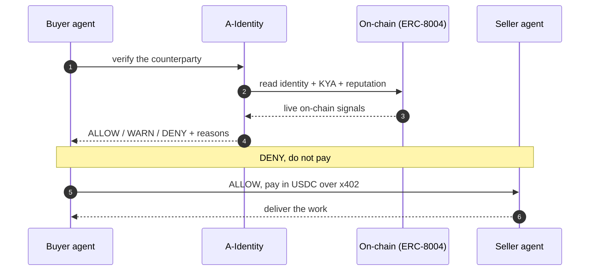

A-Identity gives every AI agent two things it does not have today: a way to prove
who it is, and a way to pay. Identity comes first (Know Your Agent), then
settlement in stablecoins, under permissions that both sides agree to.

It is built on three open protocols. We did not invent them. We connect them into
one agent-native stack.

**The one rule: verify first, then pay.**

<Frame caption="The same loop as a picture: the owner sets limits, identity and KYA are checked on-chain, the policy engine bounds the spend, USDC settles, and a receipt lands in the audit trail. The board was drawn for Arc testnet, the phase-1 network. The loop now also runs on the mainnet rails listed under Chains.">
  
</Frame>

<CardGroup cols={3}>
  <Card title="ERC-8004" icon="fingerprint" href="/protocols/erc-8004">
    Portable on-chain identity and reputation for agents. A-Identity reads live
    ERC-8004 registries deployed on Circle Arc testnet.
  </Card>
  <Card title="x402" icon="coins" href="/protocols/x402">
    Pay-per-action over the HTTP 402 standard, settled in stablecoins.
  </Card>
  <Card title="MCP" icon="plug" href="/protocols/mcp">
    The Model Context Protocol. How agents reach your tools, and pay for them.
  </Card>
</CardGroup>

## What You Can Build

<CardGroup cols={2}>
  <Card title="Verify An Agent" icon="badge-check" href="/concepts/know-your-agent">
    Resolve an agent's identity and reputation before you transact with it.
  </Card>
  <Card title="Bound What It Can Spend" icon="shield" href="/concepts/bounded-authority">
    Set a limit that's enforced three ways, including an on-chain revert on Arc.
  </Card>
  <Card title="Charge Per Action" icon="circle-dollar-sign" href="/protocols/x402">
    Wrap any tool or endpoint in an x402 paywall and get paid in USDC, on-chain or
    gasless and sub-cent with [Nanopayments](/protocols/nanopayments).
  </Card>
  <Card title="Connect Over MCP" icon="network" href="/developers/mcp-server">
    Expose your service to agents through a Model Context Protocol server.
  </Card>
  <Card title="Embed The SDK" icon="code" href="/developers/sdk">
    Drop identity and payments into your own agent in a few lines.
  </Card>
</CardGroup>

## A Note On Safety

Anything that holds a key, deploys a contract, or moves real value stays
human-on-the-loop. A person approves it. Agents act inside the limits and policies
you set. The idea is a human in the tower, not in the driver's seat.
