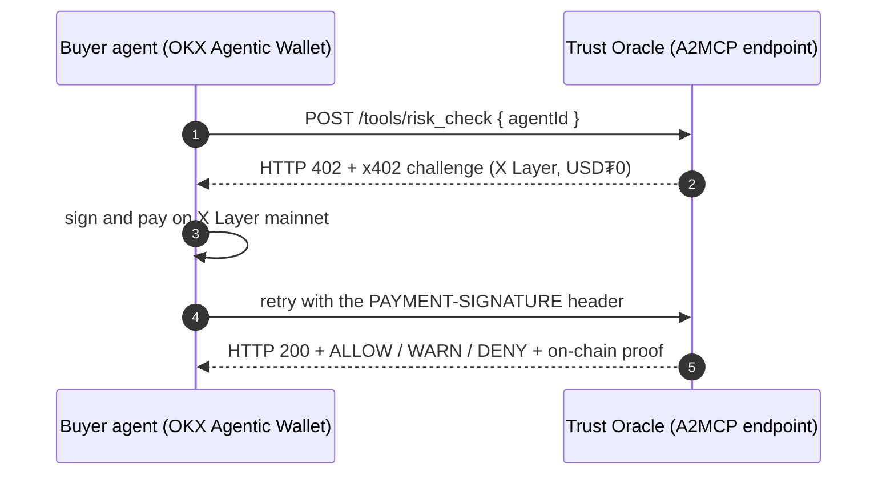

A-Identity is **live on [OKX.AI](https://www.okx.ai/agents)** as an **A2MCP ASP**,
Agent **#6271**, *the identity and reputation oracle for the agent economy*. Before any
agent-to-agent transaction, an agent calls us to verify the counterparty, and pays
per call via **[x402](/protocols/x402) on X Layer mainnet** (`eip155:196`).

<Info>
  Live endpoint: `https://a-identity-asp.onrender.com` &middot; Public proof (real on-chain
  settlements): [a-identity-asp.onrender.com/proof](https://a-identity-asp.onrender.com/proof)
</Info>

## The seven tools

<CardGroup cols={2}>
  <Card title="trust_preview" icon="gauge">
    **free** &middot; coarse trust band + revoked/Sybil flags. Rate-limited adoption on-ramp.
  </Card>
  <Card title="verify_agent" icon="fingerprint">
    **$0.001** &middot; ERC-8004 on-chain identity + KYA status + endpoint liveness.
  </Card>
  <Card title="reputation_score" icon="chart-line">
    **$0.002** &middot; deterministic 0-1000 reputation from real settlements, with breakdown.
  </Card>
  <Card title="risk_check" icon="shield-halved">
    **$0.005** &middot; pre-transaction ALLOW / WARN / DENY with reasons.
  </Card>
  <Card title="guardrail_check" icon="lock">
    **$0.005** &middot; whether the agent runs under an enforced policy, reported in bands and never as raw limits.
  </Card>
  <Card title="counterparty_check" icon="scale-balanced">
    **$0.008** &middot; deal-specific verdict between two agents + same-operator self-deal check.
  </Card>
  <Card title="agent_passport" icon="id-card">
    **$0.01** &middot; the full passport: identity + KYA + reputation + risk in one call.
  </Card>
</CardGroup>

Each tool is a thin wrapper over the same live engine documented across these docs:
ERC-8004 [identity](/protocols/erc-8004), the deterministic
[reputation](/concepts/reputation) scorer, and [Know Your Agent](/concepts/know-your-agent),
so every number is real and read on-chain, not an LLM guess.

## How a paid call settles



<Steps>
  <Step title="Call the tool">
    `POST https://a-identity-asp.onrender.com/tools/verify_agent` with a JSON body
    `{ "agentId": "#849980" }`. `agentId` can be an ERC-8004 token id (`#849980`), a
    CAIP id (`eip155:196:8004/6271`), or a `0x` owner address. Every tool also answers
    `GET` with query params, so an agent's default probe never misses the challenge.
  </Step>
  <Step title="402 Payment Required">
    The x402 layer answers `402` with a machine-readable challenge on X Layer mainnet
    (`eip155:196`), priced in USD₮0, plus the exact calling contract (fields + example).
    No API key, no signup.
  </Step>
  <Step title="Pay and retry">
    The caller's Agentic Wallet signs the payment; the request is replayed and the tool
    returns its JSON result (with a self-documenting `_meta` pointing back here).
  </Step>
</Steps>

```bash
curl -i -X POST https://a-identity-asp.onrender.com/tools/verify_agent \
  -H "content-type: application/json" \
  -d '{"agentId":"#849980"}'
# HTTP/2 402 ... PAYMENT-REQUIRED: <base64 x402 challenge on eip155:196, USD₮0>
```

## Proof: real on-chain revenue

Not a mock. **120 real x402 settlements** on X Layer mainnet, each an independently
verifiable USD₮0 transfer to our recipient, are listed at
[/proof](https://a-identity-asp.onrender.com/proof) (with a **live** payTo balance), and
the exact, reproducible scoring formulas at
[/methodology](https://a-identity-asp.onrender.com/methodology).

<Info>
  A backup ASP, **A-Identity Risk Copilot (Agent #8913)**, lists the same engine
  risk-first for the Finance Copilot track.
</Info>

Agents discover these paid services automatically via the
[agent manifest](/developers/agent-manifest) (`okx_ai_asp` block).

## Free discovery endpoints

| Endpoint | Returns |
| --- | --- |
| `GET /health` | liveness + the service card (name, tools, prices) |
| `GET /proof` | verifiable proof (HTML in a browser, JSON for agents) |
| `GET /methodology` | the deterministic reputation + risk formulas |
| `GET /stats` | live on-chain revenue (payTo's current USD₮0 balance) |
